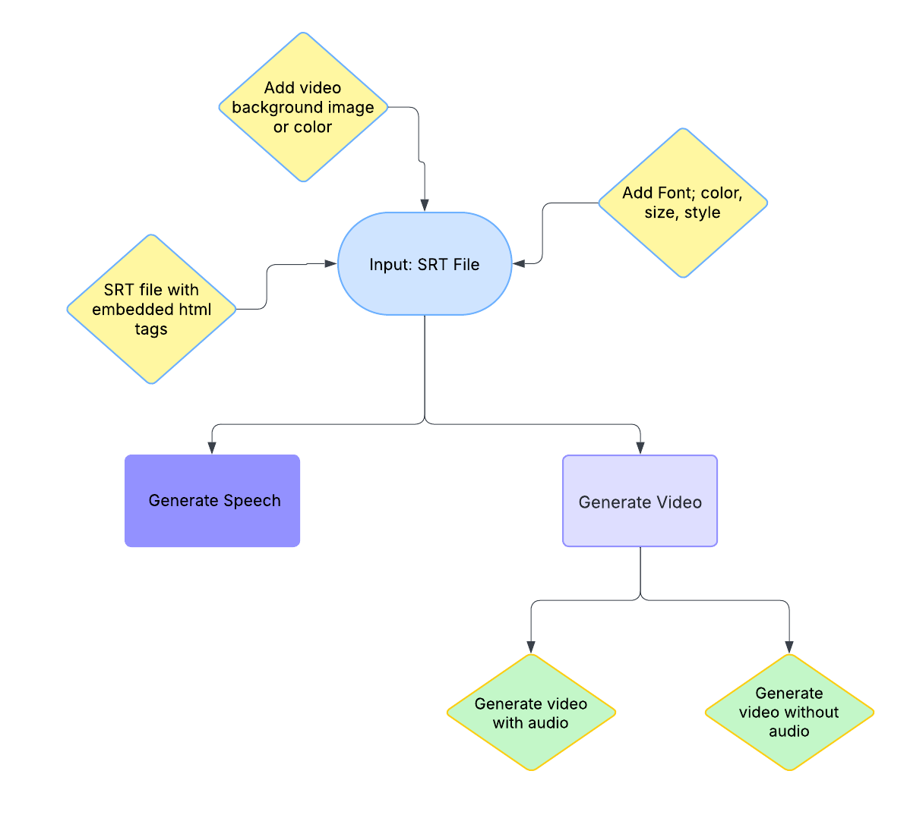
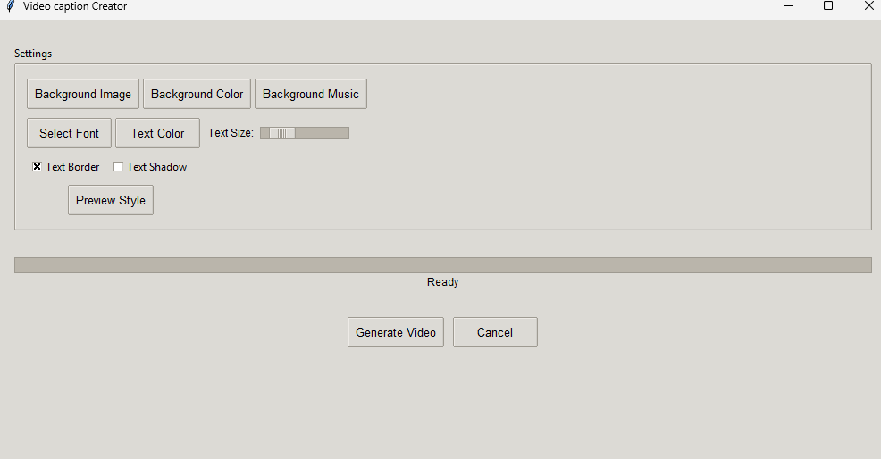

# Video Caption Creator 🎥🔊
> A Python-powered tool for automated video captioning and audio/video synchronization. Enhance your video content with smart captioning and audio synchronization features.


[](https://github.com/psf/black)

## Purpose

This project provides an innovative solution for content creators to:

    * Automatically generate captioned videos using SubRip (SRT) subtitle files
    
    * Create synthetic speech/audio tracks from text-based subtitle files
    
    * Perfectly synchronize video content with generated audio tracks

Designed to streamline workflows for video production, language localization, and accessible content creation.

## Key Features ✨

    * SRT-to-Audio Conversion: Transform subtitle files into natural-sounding speech using text-to-speech (TTS) integration

    * Caption Overlay: Automatically burn subtitles into video files with customizable styling

    * Media Synchronization: Intelligent alignment of generated audio with video content

    * Batch Processing: Handle multiple files and formats in single operations

    * Format Flexibility: Supports common audio formats (WAV, MP3)

## Ideal For 💡

    * Content creators needing rapid video localization

    * Educators creating accessible learning materials

    * Social media managers producing multi-language content

    * Developers building automated video pipelines

    * Podcasters converting transcripts to video format

### Captivating captions

"Video Caption Creator" supports SRT files with embedded HTML styling, allowing you to create captivating captions with enhanced visual appeal. 
This means you can highlight specific words, change formatting, and make your subtitles more engaging.

## Key styling options include:

* Combined font styling: `<font size='48'><font face='Arial'>Text</font></font>`
* Bold text formatting: `<font size='48'><font face='Arial'>Text with <b>bold</b> words</font></font>`
* Consistent styling across subtitles: All text using Arial font, size 48

[](https://www.youtube.com/watch?v=rjFq3P9vhHs)

## Why This Matters
In content creation workflows, manually synchronizing audio with captions can consume up to 40% of production time (Source: Content Marketing Institute). This tool aims to eliminate that bottleneck through intelligent automation.

### Installation

For windows users:
Download 7z file from [here](https://github.com/overcrash66/Video-caption-Creator/releases/download/v1.0.0/Video-Caption-Creator.7z)

Extract and execute Video-Caption-Creator.exe

Or

* Clone or download this repository

* Install Python version >= 3.10

* Install `ffmpeg` [for your platform](https://ffmpeg.org/download.html)

* Create a vitrual env:

```
py -3.10 -m venv venv
```

```
venv\Scripts\activate
```

* Install Python dependencies: `pip install -r requirements.txt`

If you like to use torch with cuda:

```
pip uninstall torch torchaudio
pip install torch==2.5.1+cu118 torchaudio==2.5.1+cu118 --index-url https://download.pytorch.org/whl/cu118
```

### GUI usage

You can run the GUI with `python main.py`.




## Unit Tests

Install tesseract from [UB-Mannheim's tesseract installer](https://github.com/UB-Mannheim/tesseract/wiki)

Install unit tests requirements

```
pip install -r test-requirements.txt
```

Run tests

```
python run-tests.py
```

Compliance Notice ⚖️

This project utilizes XTTS v2 from Coqui AI for text-to-speech generation. Users and contributors must adhere to:

* Model License
  * XTTS v2 is licensed under:
    * CC BY-NC-ND 4.0 for the pre-trained models
    * Apache 2.0 for the codebase

* Commercial Use Restrictions ❗
  * The XTTS v2 model weights are non-commercial use only under CC BY-NC-ND 4.0. For commercial applications:
    * Obtain commercial licensing from Coqui AI
    * Consider training your own models
    * Use alternative commercial TTS services

* Ethical Usage 🤖
  * Users must not employ this tool for:
    * Generating misleading/deceptive content
    * Impersonating individuals without consent
    * Creating content violating human rights principles