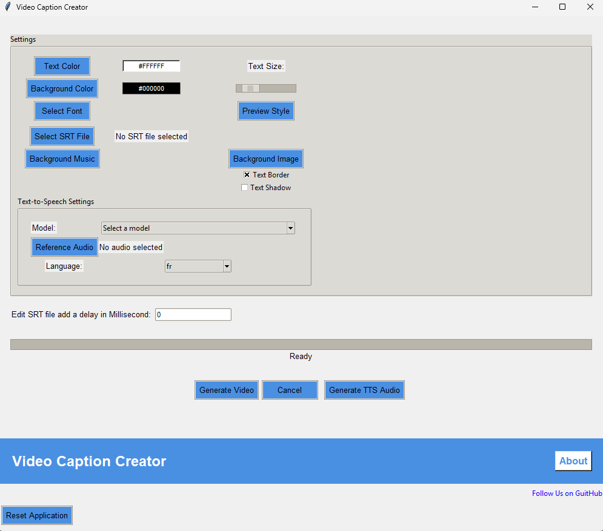

# Video caption Creator

The Video Caption Creator is a Python program designed to generate captioned videos using SRT files. 
It supports generating speech or audio from SRT files, as well as merging and synchronizing video with audio

### Captivating captions

"Video Caption Creator" supports SRT files with embedded HTML styling, allowing you to create captivating captions with enhanced visual appeal. 
This means you can highlight specific words, change formatting, and make your subtitles more engaging.

Key styling options include:

    Custom fonts
    Font style, size, and color
    Additional text formatting for emphasis

[](https://www.youtube.com/watch?v=rjFq3P9vhHs)

### Installation

* Clone or download this repository

* Install Python version >= 3.10

* Install `ffmpeg` [for your platform](https://ffmpeg.org/download.html)

* Create a vitrual env:

```
py -3.10 -m venv venv
```

```
venv\Scripts\activate
```

* Install Python dependencies: `pip install -r requirements.txt`

If you like to use torch with cuda:

```
pip uninstall torch torchaudio
pip install torch==2.5.1+cu118 torchaudio==2.5.1+cu118 --index-url https://download.pytorch.org/whl/cu118
```

### GUI usage

You can run the GUI with `python main.py`.




## Unit Tests

Install tesseract

```
https://github.com/UB-Mannheim/tesseract/wiki
```

Install unit tests requirements

```
pip install test-requirements.txt
```

Run tests

```
python run-tests.py
```

## License

This project is licensed under the MIT License - see the [LICENSE](LICENSE) file for details.